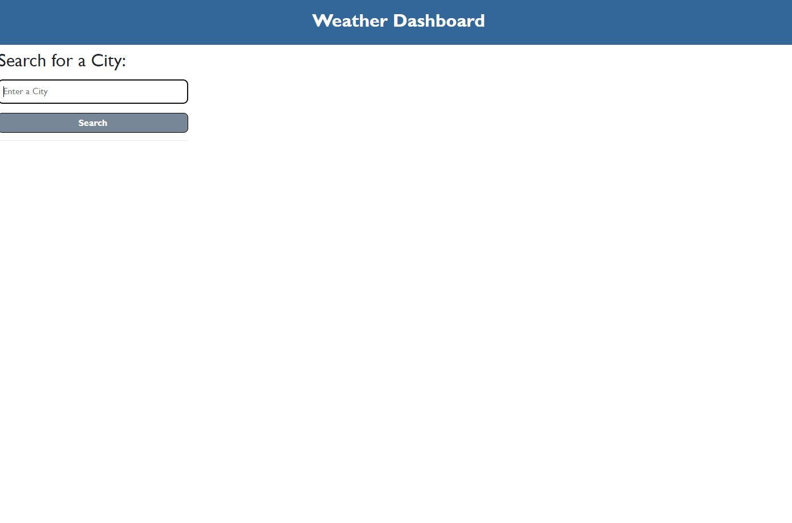
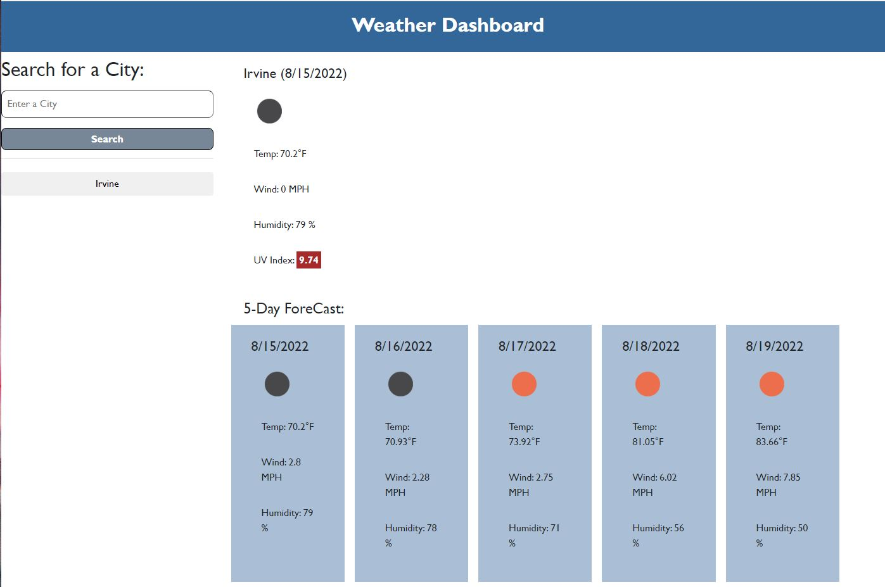
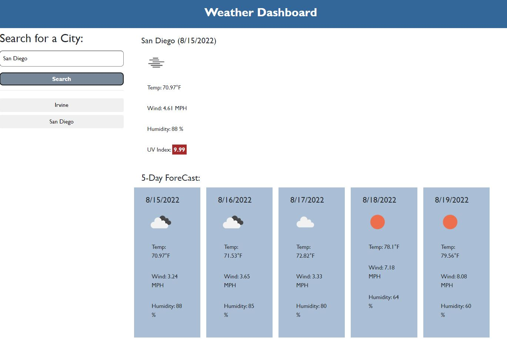
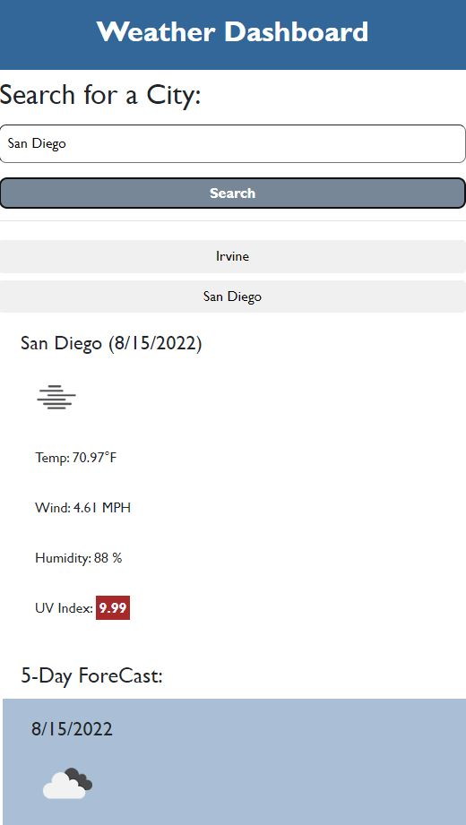

# challenge6_WeatherDashboard
This is the project for week 6. It contains server side API practice. Final Draft 8/15/2022

## Project Description
In this project, I created a weeather dashboard to show the current weather and forecast of a given city. 

## APIs utilized 
moment.js, openWeather API

## Function deployed
Given a city name, the weather dashboard shows its current weather (Temperature, Wind speed, Humidity, and UV Index) and the weather forecast (Temperature, Wind speed, and humidity)for 5 days. Search history will be stored. If user click the search history button, the corresponding weather information will be shown on the dashboard.

## Project Outcome Overview
[Visit my Weather Dashboard Page Here](https://aurorayihe.github.io/challenge6_WeatherDashboard/)

Initial Page

Search Page

Multiple Search

Page layout on smaller screens
